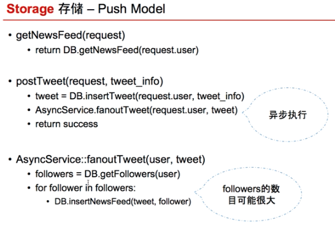

# News Feed System 

## Company 

* Twitter
* Facebook
* Wechat

## Keyword

* News Feed (新鲜事): 好友或者关注者上传/分享的内容
* Timeline (时间轴): 自己上传/分享的内容

## 考察核心: 

* 新鲜事系统的存储和访问

## Solution Analysis:

* Pull Model:
        
        1. 过程:
        
        
        
        2. Algorithm: 
        
            Read:
                a.获取所有好友
                b.获取每个好友的前k条tweets
                c.根据时间顺序 - mergeSort
                d.从merge好的tweets中选取前k条
                
            Write:
                a.append到自己的timeline
            
            
            
            Sudo Code:
            
            Time Complexity:
        
                Read: 假设总共有n个好友，则需要n次DB reads + mergeSort (内存操作，可忽略)
                
                Write: 1次DB write
        
        3. 缺点: 
        
            读操作中的DB read很慢, 因为是用户查询的时候现读的；直接影响用户体验
                
        
* Push Model:
            
        1. 过程:
        
        
        
        2. Algorithm:
            
                Read:
                    a. 只需从News Feed表中读取属于自己关注的前k条tweets即可
        
                Write:
                    a. 用户写了一个tweet
                    b. 系统创建一个任务，将推文推送(push)给每个follower (fanout -> 异步消息队列实现), 可以使用一个超大的News Feed Table来记录
                    
                    
                
                Sudo Code:
                
            
                Time Complexity:
                
                    Read: 1次DB read
                    
                    Write: 假设有n个followers, 需要n次DB writes; 但无需阻塞用户，可使用异步任务在后台执行
                
        3. Table Schema:
        
        
        
        4. 缺点:
            
            大V用户发一条推的话需要fanout很久, 从而导致刷到的news feed有延迟; 同时短时间也会给系统带来很大处理压力 (异步消息队列)
            浪费很多空间为僵尸用户创建news feed记录
            需要维护一个很大的News Feed Table (需要sharding, 创建索引等)
            
           
            

## Trade-off Analysis:

具体情况具体分析。。
